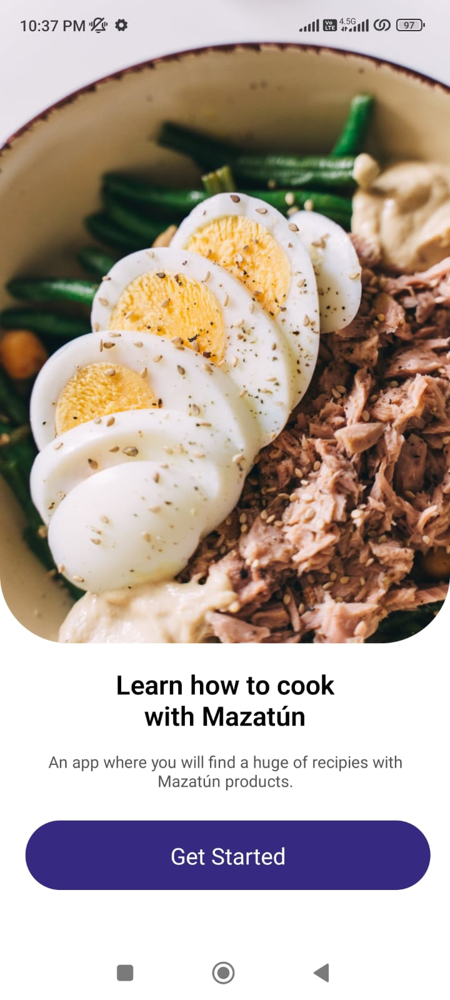
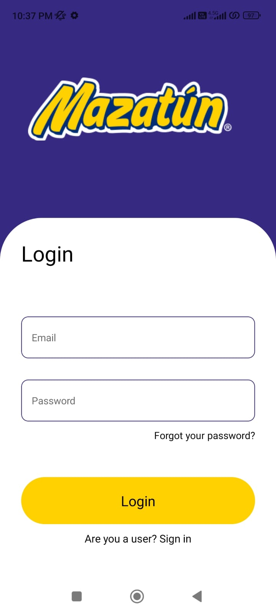
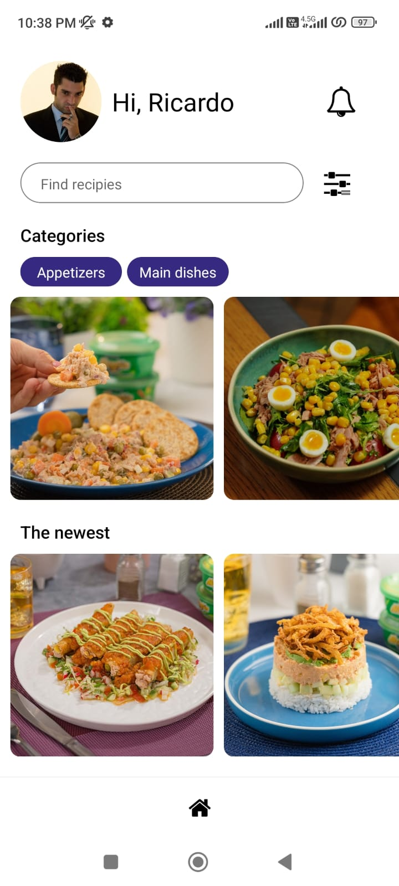

# Mazatun app

## Como ejecutar la app?

1. Clonar el respositorio desde Github: git clone <URL> 2. Instalar las dependencias del proyeco 3. Ejecutar el comando npx expo start 4. Pulsar la tecla "a" en consola para iniciar un emulador o escanear el QR desde tu dispositivo movil

# Interfaz 1

_Descripcion:_ La primera interfaz o pantalla de nuestra aplicacion, es una vista de bienvenida. En esta interfaz se encuentra una peuqeña frase referente
a la aplicaion, una descripcion de la aplicacion y un boton que nos permitira ir al Login.

# Interfaz 2

_Descripcion:_ En la segunda interfaz se muestra un login que permitira al usuario ingresar sus credenciales para iniciar sesion dentro de la apliacion y una vez hecho esto podemos dar click al boton de login para iniciar sesion.

# Interfaz 2

_Descripcion:_ Por ultimo la tercera interfaz tiene una imagen del usuario, un saludo al mismo, una barra de busqueda y un boton para poder aplicar filtros a los resultados. Despues tenemos diferentes imagenes que hacen referencia a los alimentos que puedes cocinar con Mazatun y dependiendo de en que categoria se encuentre son las recetas que se mostraran, por ultimo esta la parte de recetas nuevas donde se muestran las recetas mas recientes y nuevas.

